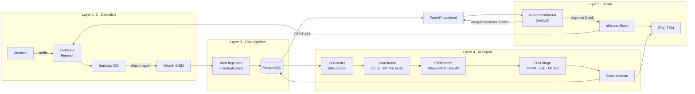
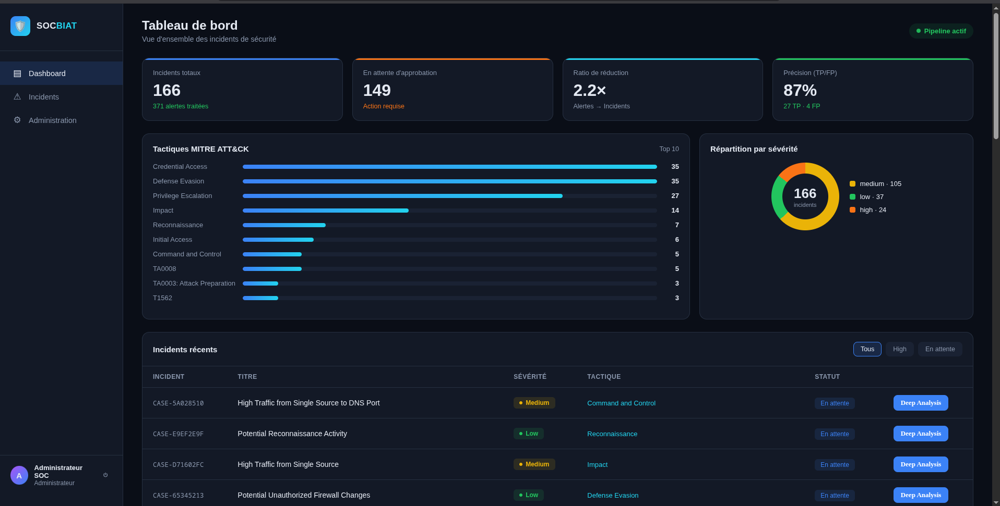
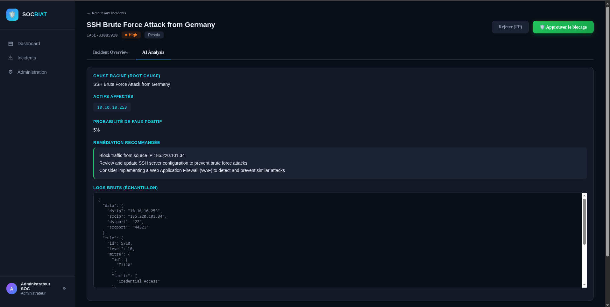
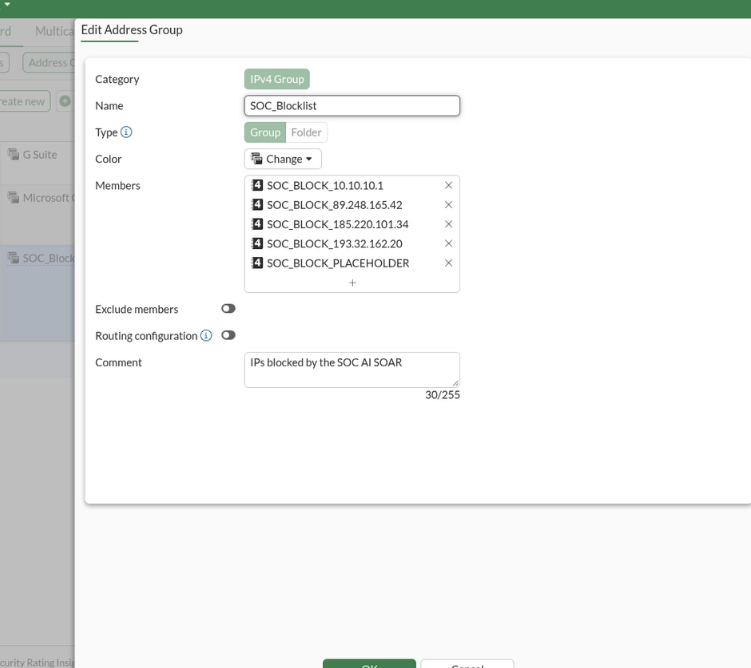

# 🛡️ SOC-AI — AI-Enhanced SOC with Intelligent Data Pipeline & Human-in-the-Loop SOAR

> An end-to-end Security Operations Center platform that **ingests, correlates, triages, and contains** threats, combining a SIEM/IDS stack, LLM-based alert triage, and analyst-approved automated firewall blocking.


> 🎓 Final-year engineering project (PFE): Cybersecurity Engineering, Tek-Up University

---

## 📌 The problem

SOC analysts drown in alerts. Most are duplicates or false positives, and the real incidents get buried. Fully automated response is risky, while fully manual response is too slow.

## 💡 The solution

SOC-AI adds an **intelligence layer** between detection and response:

1. **Correlates** many raw alerts into a single incident (N alerts → 1 case)
2. **Enriches** each incident with IP reputation (AbuseIPDB) and geolocation
3. **Triages** it with an LLM: true/false positive verdict, MITRE ATT&CK tactic, risk score, recommended action
4. Keeps a **human in the loop**: the analyst reviews the AI analysis and approves containment with one click
5. **Contains** the threat automatically: n8n pushes the attacker IP into a FortiGate deny policy and updates the ITSM ticket

---

## 🏗️ Architecture



| Layer | Role | Components |
|---|---|---|
| **1–2 · Detection** | Generate & centralize security events | FortiGate, Suricata IDS, Wazuh SIEM |
| **3 · Data pipeline** | Clean, deduplicate, normalize, enrich, store | FastAPI webhook, Redis (dedup), GeoIP, AbuseIPDB, NVD, PostgreSQL |
| **4 · AI engine** | Correlate, triage, open cases | APScheduler, LLM (OpenAI-compatible API), Prometheus metrics |
| **5 · SOAR** | Human-approved response & ticketing | n8n (Feedback + Containment workflows), FortiGate REST API, iTop |
| **Presentation** | Analyst interface | React dashboard + FastAPI backend |

---

## ✨ Key features

- **Alert correlation:** groups alerts by `source IP × MITRE tactic` to cut analyst noise
- **LLM triage:** structured JSON verdict: true/false positive, confidence, MITRE mapping, risk score, recommended action
- **Threat intel enrichment:** AbuseIPDB reputation, GeoIP location and NVD CVE lookups
- **Redis deduplication:** fingerprints repeated alerts inside a time window so they don't flood the pipeline
- **Observability:** Prometheus metrics (cycles, alerts processed, cases created, LLM latency) on `:9100/metrics`
- **Human-in-the-loop containment:** nothing is blocked until an analyst clicks *Approve Block*
- **Automated FortiGate blocking:** attacker IP added to a blocklist address group behind a dedicated deny policy
- **Idempotent actions:** already-blocked IPs and duplicate feedback are detected and skipped
- **ITSM integration:** iTop incident tickets created and resolved automatically
- **Analyst feedback loop:** TP/FP decisions stored per alert to measure and improve AI accuracy
- **Provider-agnostic LLM layer:** any OpenAI-compatible endpoint, switchable through `.env` only

---

## 🖥️ Screenshots

| Dashboard | Deep analysis |
|---|---|
|  |  |

| AI triage result | FortiGate containment |
|---|---|
|  |  |

---

## 🧪 Lab environment

Six-VM lab on KVM/libvirt (Fedora host), isolated network `10.10.10.0/24`:

| VM | Role |
|---|---|
| FortiGate (FortiOS 7.6) | Perimeter firewall, containment target |
| Ubuntu 22.04 | Suricata IDS + Wazuh agent |
| Wazuh server | SIEM |
| Windows Server | Active Directory DC + iTop ITSM |
| Ubuntu 22.04 (`ai-pipeline`) | AI engine, FastAPI, PostgreSQL, n8n (Docker) |
| Fedora host | Attack simulation |

---

## 📂 Repository structure

```
soc-ai/
├── pipeline/                # Data pipeline + AI engine (runs every 60s)
│   ├── layer3/              # cleaner (Redis dedup), normalizer, enricher (GeoIP · AbuseIPDB · NVD), db_writer
│   ├── layer4/              # correlator, llm_analyst, case_creator, engine (scheduler + Prometheus)
│   ├── api/                 # webhook (alert ingestion) + analyst feedback endpoints
│   ├── config/              # settings.py (reads .env)
│   └── main.py              # pipeline entry point
├── backend/                 # FastAPI: auth, incidents, actions (n8n + iTop clients)
├── frontend/                # React + Vite SOC dashboard
├── soar/n8n-workflows/      # Exported n8n workflows (Feedback, Containment)
├── database/schema.sql      # PostgreSQL schema
├── scripts/                 # Demo / attack simulation scripts
├── docs/screenshots/
├── .env.example
└── README.md
```

---

## 🚀 Getting started

```bash
git clone https://github.com/jawherxxd/soc-ai.git
cd soc-ai
cp .env.example .env        # fill in your own keys and hosts

# Database
psql -U postgres -f database/schema.sql

# Redis (used for alert deduplication)
docker run -d --name redis -p 6379:6379 redis:7

# GeoIP database (not redistributed — free MaxMind account required)
# download GeoLite2-City.mmdb into pipeline/

# Pipeline + AI engine (webhook on :8000, metrics on :9100)
cd pipeline && python3 -m venv venv && source venv/bin/activate
pip install -r requirements.txt && python main.py

# Backend (dashboard API on :8080) — create demo users once with setup.py
cd ../backend && python3 -m venv venv && source venv/bin/activate
pip install -r requirements.txt && python setup.py && python main.py

# Frontend
cd ../frontend && npm install && npm run dev

# Demo: simulate a brute-force attack
bash scripts/inject_bruteforce.sh

# SOAR: start n8n, then import soar/n8n-workflows/*.json
docker run -d --name n8n -p 5678:5678 n8nio/n8n
```

> ⚠️ Requires your own Wazuh, Suricata and FortiGate lab. Never point the containment workflow at production firewalls without review.

---

## 🎬 Demo scenario

1. Inject alerts from known-malicious public IPs into the pipeline
2. The AI engine correlates them into one incident, enriches it (AbuseIPDB score, country) and the LLM classifies it as a **true positive**, mapped to MITRE ATT&CK
3. An iTop incident ticket is opened automatically
4. The analyst opens the case in the dashboard and clicks **Approve Block**
5. n8n adds the IP to the FortiGate blocklist and resolves the iTop ticket

---

## 🧠 Lessons learned

- **LLM providers change without notice.** A model reached end-of-life mid-project, so the LLM layer was made provider-agnostic (any OpenAI-compatible API, configured by `.env`)
- **Reasoning-style models can break structured output** by returning text outside the main content field, so models are chosen for reliable JSON
- **Long-running schedulers need fresh DB connections.** Components are created inside each cycle to avoid silently stale PostgreSQL connections
- **Keep ITSM out of the critical path.** Containment goes directly through n8n to the firewall; the ticketing system only records it

---

## 🔭 Roadmap

- [ ] Docker Compose for one-command deployment
- [ ] Sigma rule support in correlation
- [ ] Automatic unblock after a configurable TTL
- [ ] Use analyst feedback to tune triage prompts

---

## 👤 Author

**Jawher Yahyaoui**, Cybersecurity Engineer
[LinkedIn](https://www.linkedin.com/in/yahyawi-jawher-3625a7186) · [GitHub](https://github.com/jawherxxd)
